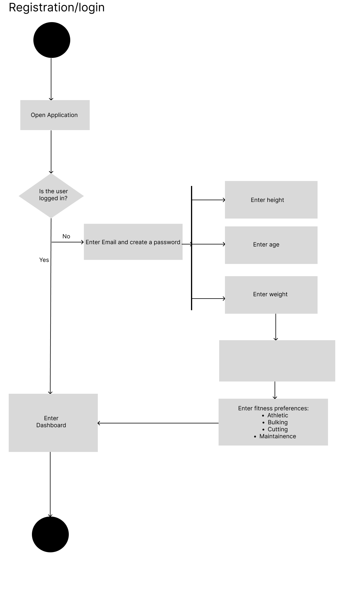
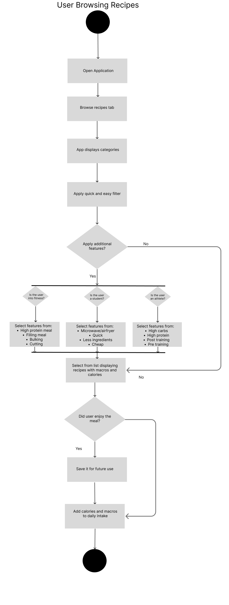
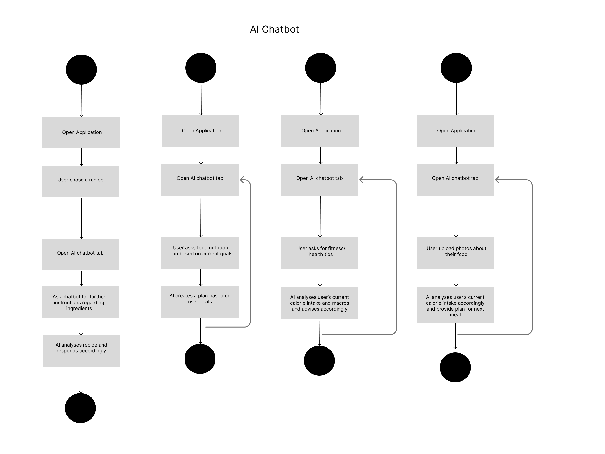
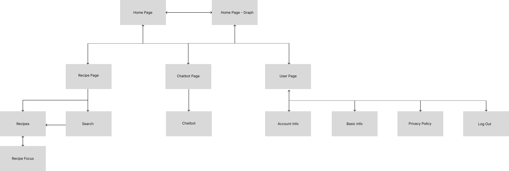

# Specification Phase Exercise

A little exercise to get started with the specification phase of the software development lifecycle. See the [instructions](instructions.md) for more detail.

## Team members

Abid Ali Qureshi - https://github.com/Abid2422 
Jeffrey Solano - https://github.com/jeffnoso 
Haoze(Frank) Wu - https://github.com/HandEater 
Wonden Gyatso - https://github.com/wondeng 
Natt Hong - https://github.com/nmh6063-star

## Stakeholders
Raahim V. - Tennis Player/Student Athlete:
As an athlete Raahim track his calories by using rough estimates, as of now he does not use any application.
He believes that an app that would provide healthy and delicious recipes would bring "an element of ease". His personal goals suggest he would prefer recipes of meals that are filling and that can help him sustain for a while both which can be made quickly or meals that require effort. He believes an app that provide proper nutrition plans would really help him out.

Kaysan K. - Soccer Player/Student:
Kaysan is someone who is going through his weight loss journey and for him if he ever needs to cook something he uses Youtube and Google for recipes with detailed tutorials. He would prefer an app which is "easy, convienient and specific". Kaysan believes if the app had an AI assistant that could answer his questions on the spot while he's cooking, it could really help him. Additionally, he would also like if there was a video available or if not a video, detailed recipes would be his preference. Easy, healthy and tasty recipes are his bread and butter.

Laura A. - Student:
Laura is someone who wants to begin her fitness journey. She currently has no idea on how to diet to lose weight, or how to track calories accurately. She would like an app that is able to explain this process to a fresh beginner like her. Would also like simple, easy-to-make recipes that fit into her busy schedule as she is studying abroad. She is worried about the app's ability to be used internationally, as she plans to travel a lot. Also worries about an app tracking calories when she is traveling/eating at restaurants, as it doesn't come with information about calories.

Ariel C.G. - Student:
Ariel is someone who has recently started going to the gym, and wants to put on a bit of muscle without putting on much weight. He would like an app that accurately tracks his protein, and keeps his total for each day, so he can see how hes been keeping up with his eating. Would also like an activity page to track calories lost from their workouts at the gym. Wants to have a nice variety of recipes, as he has a perception of dieting being eating the same boring meals.

## Product Vision Statement
For college students and fitness-oriented users who want to improve their diet but lack time and nutritional knowledge, dAIet is a diet-tracking and smart recipe recommendation app that provides quick meal ideas, calorie guidance, and AI-powered cooking assistance. Unlike generic recipe platforms, our app focuses on diet goals (weight loss, bulking, athletic performance) and beginner-friendly nutrition guidance.

## User Requirements

### Athlete
- As an Athlete I can create a nutrition plan based on my needs
- As an Athlete I can add and view the number of calories I have had over the day to maintain my goals
- As an Athelete I can view my macros(protien, carbs, fats etc.) to achieve my required daily intake
- As an Athlete I can view recipes for quick and easy meals that can sustain me
- As an Athlete I can ask the AI assistant to create a nutriton plan for me that fulfils my needs
- As an Athlete I can ask the AI assistant questions regarding the recipes to clear out any confusion
- As an Athlete I can filter for high protien, high carb meals for trining days
- As an Athelete I can ask the AI assistant beginner friendly explainations for what is best for me
- As an Athlete I can save recipes which I liked for future use
- As an Athlete I can change my preferences based on my preferences over time
- As an athlete, I want to see post workout meal recommendations so that I can recover faster after training.
- As an athlete, I want to track my nutrition progress over time so that I can see whether my diet supports my performance.

### Weight-Loss

- As a user who wants to lose weight I can view recipes for meals which contain lesser calories
- As a weight-loss user, I want to log a meal by taking a photo so that I can track calories with minimal effort
- As a weight-loss user, I want to describe my meal with text so that I can log food even when I can’t take a photo
-As a weight-loss user, I want the app to estimate calories with a confidence level so that I know how much to trust the number
- As a weight-loss user, I want quick suggestions for lower-calorie substitutions so that I can stay on track without feeling deprived
- As a weight-loss user, I want to set a goal rate of weight loss so that my calorie target feels realistic and safe
- As a weight-loss user, I want a weekly trend view of calories vs weight so that I can see whether my plan is working
- As a weight-loss user, I want “copy last meal” so that repeated meals take seconds to log
- As a weight-loss user, I want to track snacks separately so that I stop “forgetting” small calories that add up
- As a weight-loss user, I want reminders to log meals so that I don’t miss entries and lose accuracy

### Fitness

- As a fitness user, I can view recipes for calorie dense meals
- As a fitness user, I want the app to estimate protein, carbs, and fats so that I can hit my macro targets
- As a fitness user, I want protein to be highlighted per meal so that I can distribute intake across the day
- As a fitness user, I want to quickly log common “standard meals” (e.g., chicken+rice) so that tracking doesn’t slow me down
- As a fitness user, I want the app to recognize supplements (whey, creatine) so that my intake is complete
- As a fitness user, I want to edit ingredients (extra oil, less sauce) so that the macro estimate reflects cooking style
- As a fitness user, I want to view my weekly protein consistency so that I can ensure steady progress
- As a fitness user, I want the app to remember my frequently used portion sizes so that edits become one tap
- As a fitness user, I want a “bulk log” for multiple items at once so that I can record complex meals faster
- As a fitness user, I want to export or share my logs so that I can send them to my coach or accountability partner

### College Student

- As a college student I can view quick and easy recipes
- As a college student I can save recipes I enjoyed for future use
- As a college student I can track my daily intake to make sure I am not eating less/more than I should
- As a college student I can ask the app to alert me if I am low on calories
- As a college student I want to be able to share recipes with my friends
- As a college student I can ask the AI assistant to recommend new recipes to me
- As a college student I want to view budget friendly recipes that don't consume too much time
- As a college student I need recipes that I can cook using an air fryer/microwave
- As a college student I want beginner friendly nutrition tips so I can make more healthy choices
- As a college student I want beginner freidnly tips from the AI assistant if I want to start my fitness journey based on my goals

## Activity Diagrams

### Login Flow

### Recipe Flow

### Chatbot Flow

## App Navigation Map

## Clickable Prototype

See instructions. Delete this line and place a publicly-accessible link to your clickable prototype here.
